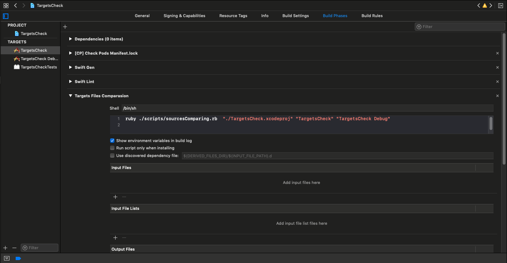
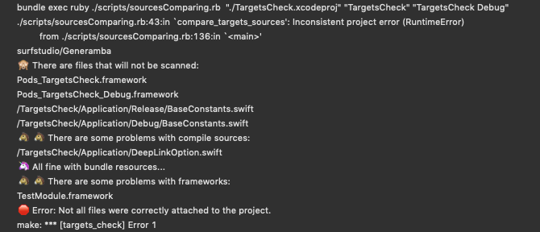
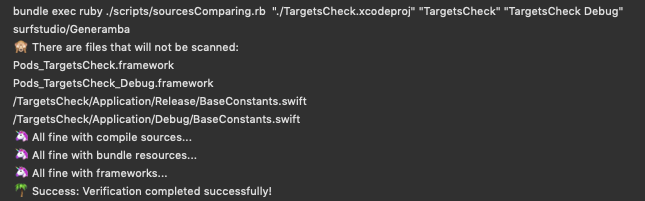

# TargetsCheck

Как часто вам приходилось сталкиваться с проблемой, когда на проекте два target'а, а какой-нибудь разработчик, добавляя новые файлы, линкует их только к одному, забывая про второй? И проект потом не собирается. Или проблема обнаруживается только на CI во время сборки, что отнимает время у сборочных нод и приводит к образованию больших очередей на них.
Если эта боль вам знакома - то этот скрипт для вас)

## Описание

Фактически, скрипт выполняет следующие шаги:

* на вход получает путь до файла проекта, а также таргеты, файлы в которых необходимо сравнить
* по пути до проекта находит сам проект
* берет оттуда нужные таргеты, собирает файлы из них (Compile Sources, Copy Bundle Resources и Frameworks)
* разница между списками файлов - это те файлы, которые есть в одном таргете, но нет в другом
* среди них могут оказаться те, которые там и должны быть (к примеру, файлы с константами, которые различаются в зависимости от таргета (baseUrl), либо файлы GoogleInfo.plist, к примеру) - это наш whitelist
* выкидывает из разницы файлы из whitelist

Если получившийся список не пуст - то у нас проблемы. Значит, тот или иной файл/фреймворк были добавлены в один таргет и не добавлены в другой.

Таки образом, скрипт позволяет убедиться, что все фалйы из Compile Sources, Copy Bundle Resources, а также сторонние фреймворки (особенно актуально, если в вашем проекте многомодульная структура) были корректно добавлены к обоим таргетам.

## Как использовать

1. Берем файл `/scripts/sourcesComparing.rb` и переносим его в папку scripts в корне вашего проекта. Рядом с ним нужно положить файл `sourceComparingWhitelist.txt`. В файле .rb - лежит непосредственно сам скрипт, в файле .txt - необходимо прописать те файлы, которые необходимо игнорировать в ходе проверки. При подключении к уже существующему рабочему проекту - рекомендуется запустить скрипт с пустым файлом whitelist, отхватить ошибок (в случае наличия файлов, явно пролинкованных к разным таргетам, или, к примеру, наличия cocoapods-зависимостей), после чего уже добавить эти файлы в whitelist.

2. Добавить новую Build Phase (конечно, в оба таргета):

	

Необходимо вызывать непосредственно скрипт:

`ruby ./scripts/sourcesComparing.rb  "./TargetsCheck.xcodeproj" "TargetsCheck" "TargetsCheck Debug"`

поставив в качестве первого параметра - путь до файла .xcodeproj вашего проекта, а далее - названия таргетов, которые необходимо сравнить между собой.

**Дополнительно** в данном репозитории показан пример, когда вызов скрипта выполняется несколько другим способом:

- добавляется новая команда `targets_check` в Makefile
- вызов скрипта идет через bundler:
	- `bundle exec ruby ./scripts/sourcesComparing.rb  "./TargetsCheck.xcodeproj" "TargetsCheck" "TargetsCheck Debug"`
- вызов `targets_check` добавлен в команду `make lint` для дополнительного прогона скрипта на CI
- в Build Phase вызывается команда `make targets_check`

В этом случае возможны проблемы, если вы не используете системынй Ruby -> XCode не дружит с выполнением скриптов через bundle в Build Phase.

Таким образом, после выполнения всех действий мы получим проект, в котором на каждый build будет проходить проверка его консистентности.

## Результаты

Если вы, к примеру, забыли прикрепить файл DeepLinkOption.h и модуль TestModule ко второму таргету, то получите следующее сообщение об ошибке:

	

В случае успеха - вас ждет единорожек:

	

## Настройка окружения и запуск тестового проекта

Для настройки окружения для тестового проекта достаточно в корне проекта выполнить команду `make init`.

На вашу машину установятся все необходимые зависимости нужных версий при помощи `bundler`, а также автоматически выполнится команда `pod install`.

После этого можно открывать .xcworkspace файл проекта и начинать над ним работу. К примеру, удалить некоторые файлы из одного таргета, чтобы убедиться в работе скрипта)

**Важно** - возможны проблемы с версией `bundler`, если текущая установленная версия конфликтует с необходимыми для работы проекта гемами. Рекомендуется использовать версию **1.17.1**